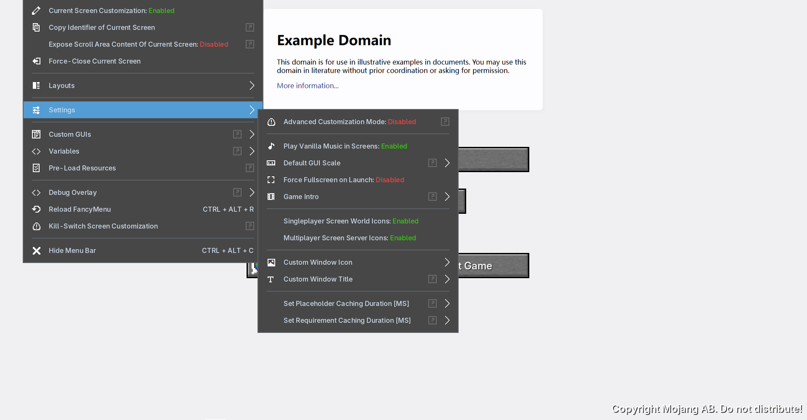

<h1 align="center">
  
  CraftBrowser
</h1>

  <b>A Minecraft Browser</b>

  

---

## Browser Implementation

- **[NCEF](https://github.com/GaoXanSheng/NCEF)** – Minecraft browser implementation based on **CefSharp**
- **Texture Swapping** – Using **[SpoutDXWrapper](https://github.com/GaoXanSheng/NCEF/tree/master/SpoutDXWrapper)** and **[JNISpout](https://github.com/leadedge/SpoutProcessing)** (Spout2) for texture sharing
---

## Features

- Embedded **CEF 140.1.140.0** browser engine
- Supports **Spout2** texture sharing
- Enables in-game webpage rendering inside Minecraft

---

## System Requirements

- Minecraft **1.20.1**
- **.NET Framework 4.0**
- Windows 10

